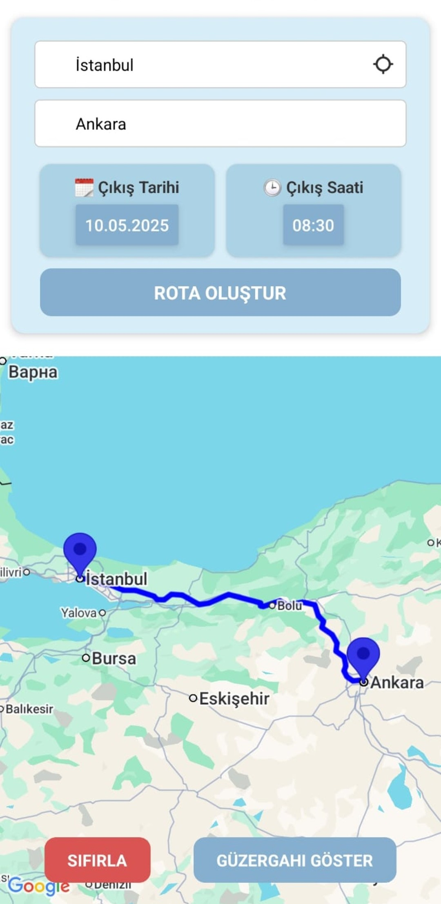
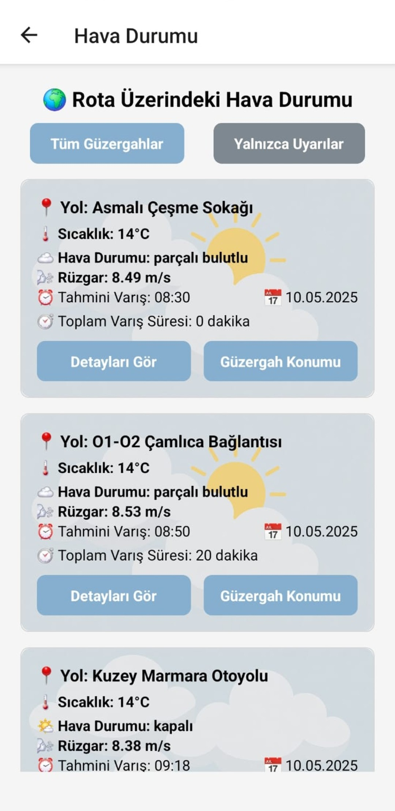
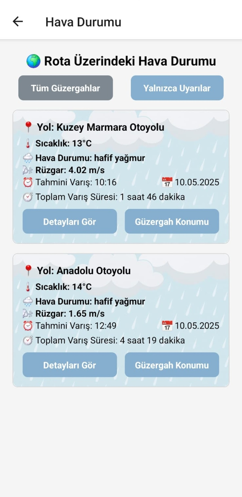
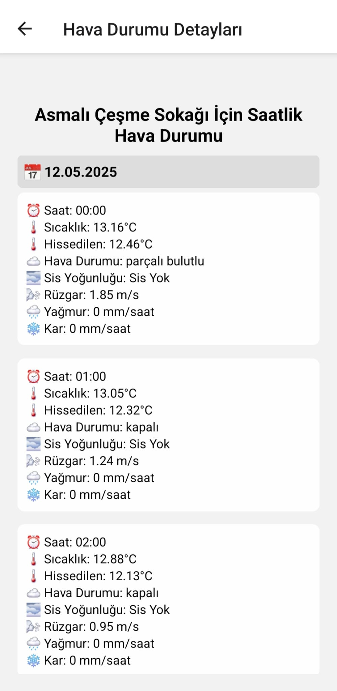
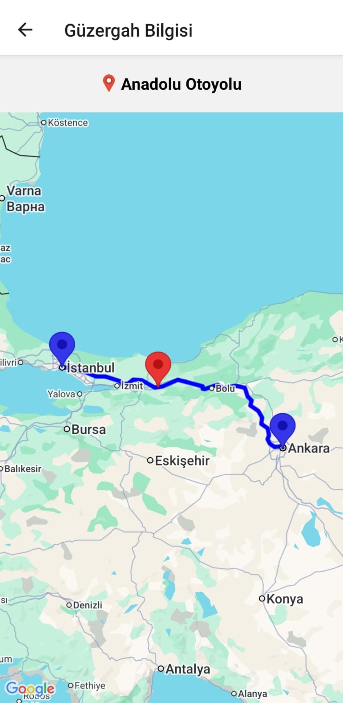

# WeatherWay ☀️🌧️

**WeatherWay**, iki şehir arasında rota oluşturup güzergah üzerindeki saatlik hava durumunu analiz eden bir mobil uygulamadır.  
🚗 Kullanıcının gideceği güzergahtaki olumsuz hava koşullarını önceden bildirerek güvenli yolculuk planlamasına yardımcı olur.

---

## 🚧 Uygulama Durumu: Google Play'de Yayında

🧪 WeatherWay şu anda **Google Play üzerinde yayındadır**.

Uygulamaya Erişmek için: **https://play.google.com/store/apps/details?id=com.berkaylmz.WeatherWay&hl=tr**

---

## 🖼️ Ekran Görüntüleri

### 1. 📍 Ana Sayfa – Rota Oluşturma

Kullanıcı iki şehir seçer, tarih ve saat belirleyerek güzergah oluşturur. Dilerse kullanıcı mevcut konumunu çıkış noktası olarak kullanabilir.

---

### 2. 🌍 Tüm Güzergah – Hava Durumu Kartları

Güzergah üzerindeki tüm yol noktalarında saatlik hava durumu detayları gösterilir:  
🌡️ sıcaklık, 🌬️ rüzgar, 🌫️ sis, 🌧️ yağış vs.

---

### 3. 📢 Kötü Hava Uyarısı Popup’ı

Uygulama, güzergah üzerinde kötü hava koşulu tespit ederse **popup uyarısı gösterir.**  
❗ Yoksa “İyi yolculuklar” mesajı ile kullanıcı bilgilendirilir.

---

### 4. ⚠️ Yalnızca Uyarılar – Filtreleme Aktif

Kullanıcı sadece kötü hava koşullarının olduğu yolları listeleyebilir.  
Sis, fırtına, yoğun rüzgar, kar, buzlanma gibi durumlar vurgulanır.

---

### 5. 📄 Saatlik Detay – Detayları Gör Butonuna Tıklanınca

Belirli bir yol noktası seçildiğinde o bölge için saat saat hava durumu tahminleri gösterilir.

---

### 5. 📌 Rota Üzerindeki Bir Güzergah Noktası

Hava durumları listelendiğinde merak ettiğiniz noktanın mevcut rotanız üzerindeki konumu gösterilir.

---

## 🔧 Kullanılan Teknolojiler

| Amaç                        | Teknoloji                           |
|-----------------------------|--------------------------------------|
| Mobil geliştirme           | React Native (Expo)                  |
| Navigasyon                 | React Navigation                     |
| Harita                     | react-native-maps + Google Maps SDK |
| Konum                      | Expo Location                        |
| Hava durumu verisi         | OpenWeatherMap API                  |
| Rota hesaplama             | OSRM Routing API                     |
| HTTP istekleri             | Axios                                |
| Tarih/saat seçimi          | react-native-modal-datetime-picker  |
| Çevresel değişkenler (.env)| dotenv & expo-constants              |

---

## ✨ Uygulama Özellikleri

- ✅ Başlangıç ve varış şehirleriyle rota oluşturma
- 📍 Kullanıcının konumunu otomatik alma
- 🕓 Seçilen saate göre rota planlama
- 🌦️ Güzergah üzerindeki tüm noktaların saatlik hava durumu
- ⚠️ Kötü hava koşulu tespiti: sis, yağmur, kar, fırtına, buzlanma
- 📢 Uyarı popup'ı ve kullanıcı yönlendirme seçenekleri
- 🧭 Detay ekran ile belirli nokta için saatlik tahminler
- 🧼 Form sıfırlama ve yeniden planlama

---
